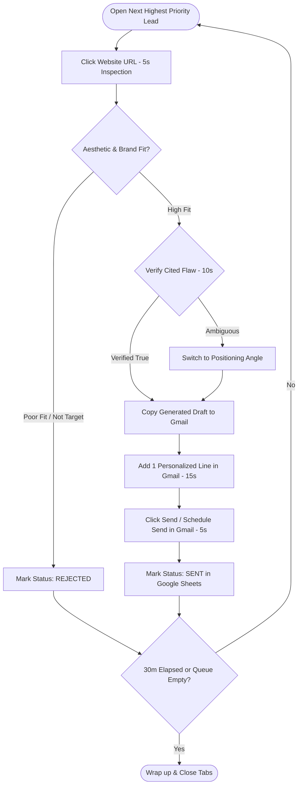
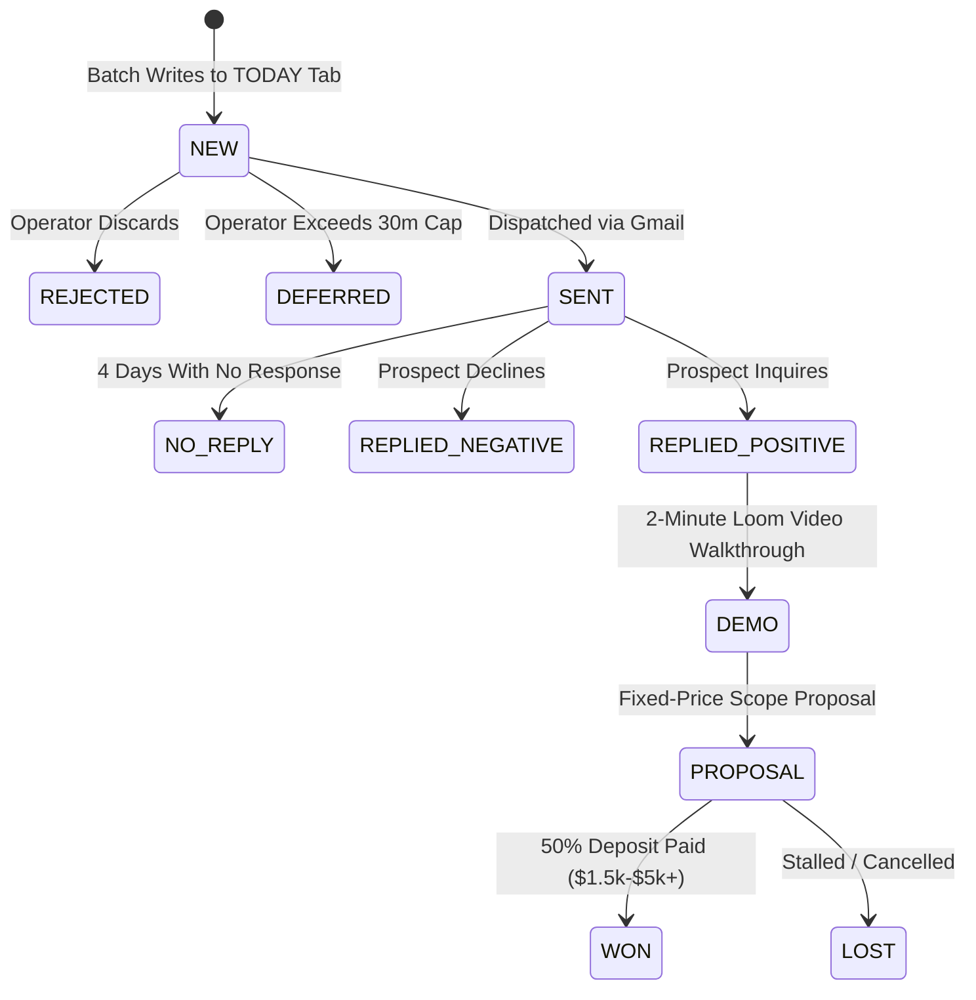

# Operator Review Workflow & Pipeline Execution Manual

> **Status:** Canonical & Active  
> **Owner:** Solo Operator / Principal Engineer  
> **Last Updated:** 2026-08-09  
> **Version:** 1.0.0  

---

## 1. The 30-Minute Daily Evening Review Ritual

Every evening (19:00–20:00), the operator conducts a time-boxed review and outreach dispatch session:

```
 00:00 - 02:00 (2 min)   │ Setup: Open Google Sheet "TODAY" tab & Gmail in split screen.
 02:00 - 27:00 (25 min)  │ Active Triage & Dispatch Loop: ~30-45 leads @ 36-60s each.
 27:00 - 30:00 (3 min)   │ Wrap-up: Review sent totals, sync outcomes, close tabs.
```

```
┌──────────────────────────────────────┬──────────────────────────────────────┐
│  GOOGLE SHEETS ("TODAY" Tab)         │  GMAIL COMPOSE WINDOW                │
│  Row 14: Studio Alpha (Score: 9/10)  │  To: alex@studioalpha.design         │
│  Issue: Mobile CTA overlaps grid     │  Subject: Quick note on Studio Alpha │
│  Pitch Angle: Mobile portfolio fixes │  Body: Hi Alex, I noticed on your... │
│  Draft Copy: [Copy to Clipboard]     │                                      │
└──────────────────────────────────────┴──────────────────────────────────────┘
```

---

## 2. The 60-Second Lead Decision Rubric



---

## 3. Lead State Machine & Outcome Tracking



---

## 4. Pipeline Execution Sequence (Stages A–F)

```
STAGE A: Candidate Discovery (Gemini Grounded Search + Showcases) ──► 100-200 URLs
                    │
                    ▼
STAGE B: Canonical Deduplication (vs. HISTORY Tab)                ──► 85-170 URLs
                    │
                    ▼
STAGE C: Cheap Deterministic Pre-Filters (HTTP 200, Blacklist)   ──► 50-80 URLs
                    │
                    ▼
STAGE D: Headless Browser Audit (Playwright Mobile 390px)        ──► Layout Metrics + JPEG
                    │
                    ▼
STAGE E: Multimodal AI Qualification (Gemini 3.5 Single-Pass)   ──► 30-50 Leads
                    │
                    ▼
STAGE F: Batch Persistence to Google Sheets ("TODAY" & "HISTORY") ──► Ready for Review
```

### Stage Attrition Breakdown:
1. **Stage A (Discovery):** 100–200 raw candidate URLs from search query matrix.
2. **Stage B (Deduplication):** 85–170 unique candidates after filtering against `HISTORY`.
3. **Stage C (Pre-Filters):** 50–80 viable sites (eliminating 404s, blogs, and non-commercial domains).
4. **Stage D (Browser Audit):** 50–80 mobile screenshots and DOM overflow metrics extracted.
5. **Stage E (AI Qual):** 30–50 qualified opportunities clearing the 4-Gate Decision Tree.
6. **Stage F (Persistence):** Appended to `TODAY` and `HISTORY` tabs in a single batch API call.
